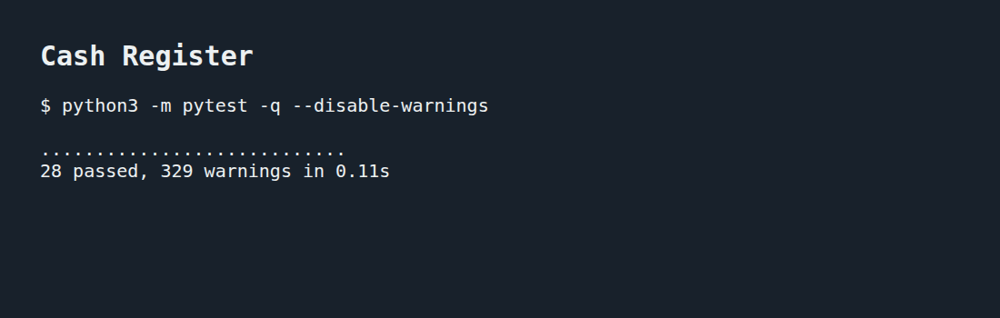

# Cash Register

A Python cash register that adds purchases, applies a percentage discount, and voids the most recent purchase.

## Setup and tests

```bash
python3 -m venv .venv
source .venv/bin/activate
pip install pytest==7.1.3
python3 -m pytest -q
```

On Ubuntu, creating the virtual environment requires `python3-venv`. This is a Python project, so no npm installation is needed.

## Example

Run this from the project folder:

```python
from lib.cash_register import CashRegister

register = CashRegister(20)
register.add_item("book", 10, 2)
register.add_item("pen", 5)
print(register.total)  # 25

register.apply_discount()  # After the discount, the total comes to $20.
register.void_last_transaction()
print(register.total)  # 16.0
print(register.items)  # ['book', 'book']
```

## Behavior

- `discount` defaults to 0 and accepts integers from 0 to 100. Invalid values print `Not valid discount` and leave the current discount unchanged.
- `add_item(item, price, quantity=1)` adds the full purchase amount to `total`. Each unit appears in `items`, and each call creates one dictionary in `previous_transactions` with the item, unit price, and quantity.
- `apply_discount()` reduces the current total and recorded unit prices. This keeps later voids consistent with the amount charged. Each call applies the discount again to the current balance. With no discount or purchases, it prints `There is no discount to apply.`
- `void_last_transaction()` removes the last purchase, including every unit in that purchase. An empty history prints `There is no transaction to void.`

Prices are numeric and quantities are positive integers. Totals use Python arithmetic; the discount message displays up to two decimal places. Each register keeps its own items and transaction history in memory.

## Test results

The tests cover the starter requirements, discount validation, separate registers, transaction history, and voiding purchases after a discount.


